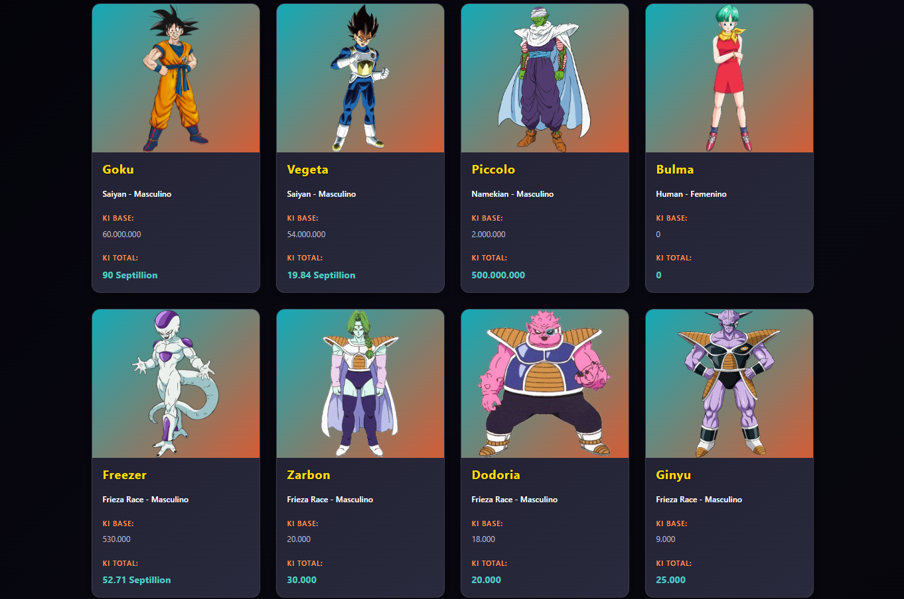

# API DRAGON BALL Z

Este proyecto es un modelo simple de cómo usar una API externa y mostrarla en tarjetas estilizadas con CSS usando React y Vite.

## Instalación
1. Abre la terminal e ingresa a una ubicación en específico
2. Clona el repositorio: `git clone https://github.com/JBriam/dbz-api-react.git`
3. Ingresa al directorio: `cd dbz-api-react`
4. Instala las dependencias: `npm install`
5. Ejecuta el proyecto: `npm run dev`

## Imágenes

